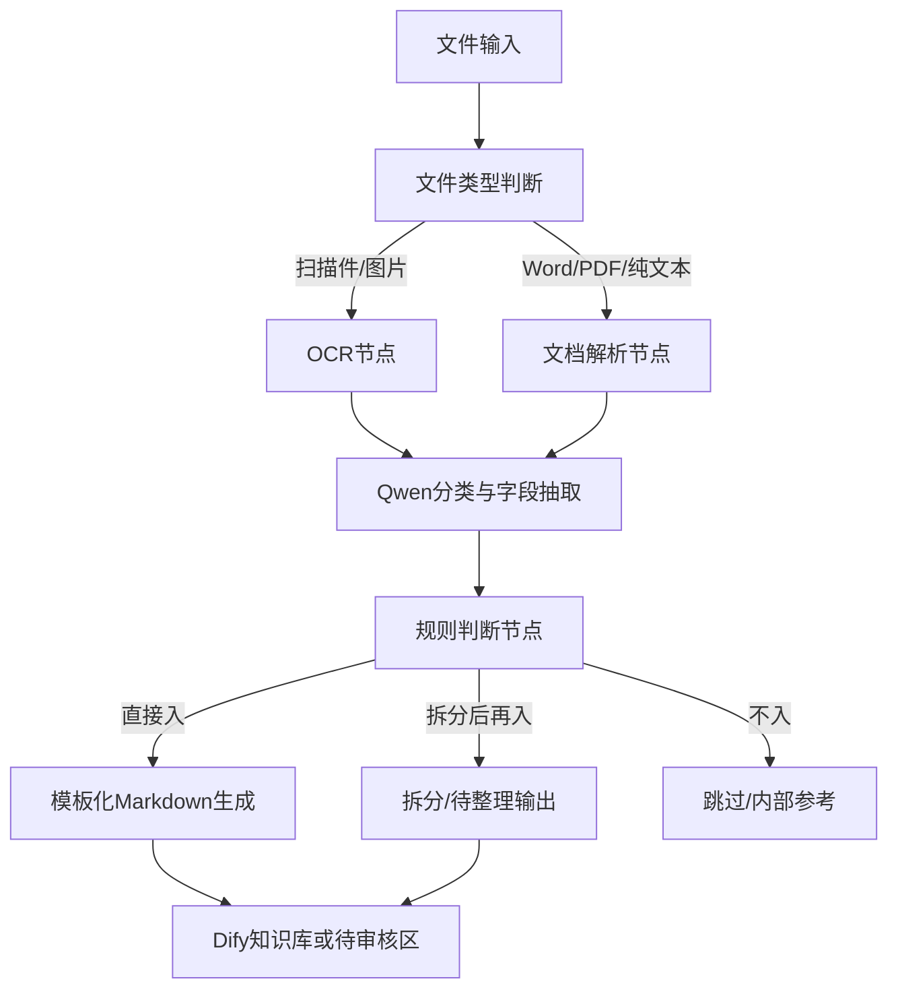

# Dify工作流最小落地方案

TLDR: 当前最适合长风这条“资料结构化入 Dify”主线的，不是一次上完整大系统，而是先落一个 **最小可用工作流**：文件输入 → 类型判断 → OCR/解析分流 → Qwen 分类抽取 → 规则判断 → 模板化 Markdown → 入库或待审核。

## 一、这页的用途
- 把当前已经收敛出的模型路线、样例口径和规则页，落成一个可执行的最小工作流。
- 目标不是一步做到全自动，而是先跑通“几类典型文件能稳定进知识库”的闭环。
- 后续批量化、自动监控、重试、日志汇总，都可以在这个最小流程上继续加。

## 二、当前建议的最小节点链路

## 三、每个节点做什么

### 1. 文件输入
- 输入对象：PDF、Word、Excel、图片、TXT、MD
- 当前建议：先人工上传或先放固定目录，再由工作流读取
- 最小目标：一次只处理 1 份文件，先保证链路稳定

### 2. 文件类型判断
- 判断是：
  - 扫描件 / 图片类
  - 纯文本 / Office / 可直接解析类
  - 混合型复杂资料
- 作用：决定后面走 OCR 还是文档解析
- 当前建议：先用文件后缀 + 简单规则判断，不必一开始就做复杂识别

### 3. OCR 节点
- 处理对象：图片、扫描件 PDF
- 作用：抽出可读文字和基础结构
- 当前建议：优先接阿里 OCR / 文档识别能力
- 输出目标：可继续送给 Qwen 的文本块或 Markdown

### 4. 文档解析节点
- 处理对象：Word、普通 PDF、TXT、MD、Office 文档
- 作用：保留章节、表格、标题、列表等结构
- 当前建议：优先接阿里解析工具，把结果统一成 Markdown / HTML / 结构化文本

### 5. Qwen 分类与字段抽取
- 主模型：Qwen-Plus（你当前阿里环境 3.6 版本）
- 主要任务：
  - 判断文档分类
  - 判断推荐模板
  - 提取最小元数据
  - 抽取模板字段
  - 判断敏感边界
  - 判断是否需要拆分
- 当前建议输出两层结果：
  1. JSON
  2. 模板化 Markdown 所需字段

### 6. 规则判断节点
- 这是当前最关键的控制点
- 作用：根据 [[04_首轮样例共性规则]] 判断文件属于哪一种：
  - 直接入
  - 拆分后再入
  - 不建议入主业务库
- 当前规则重点：
  - 正文与执行指令混合时先拆主线
  - 联系人证据不足时只保留单位级信息
  - token、key、部署命令等敏感内容不入正文
  - 内部分类口径优先归到内部资料库，而不是主业务库

### 7. 模板化 Markdown 生成
- 根据推荐模板，生成标准 Markdown 页面
- 当前应直接接你已建立的模板：
  - [[10_产品设备模板]]
  - [[11_方案案例模板]]
  - [[12_合同商务模板]]
  - [[13_供应商企业模板]]
  - [[14_政策官方文件模板]]
  - [[15_单位联系人模板]]
- 目标：生成结果尽量接近当前样例页口径，减少后期人工修订量

### 8. 入库 / 待审核输出
- 直接入：进入 Dify 知识库
- 拆分后再入：进入待审核区或人工复核区
- 不入：只留摘要或打到内部参考池
- 当前建议：第一阶段先保守一点，多走“待审核区”，不要一开始就全自动直入

## 四、当前建议固定的输出字段

### 最小 JSON 输出
- 原始文件名
- 原始文件格式
- 文档分类
- 推荐模板
- 主体名称 / 单位名称 / 产品名称
- 核心摘要
- 内容主题标签
- 敏感边界判断
- 是否适合直接入 Dify
- 是否需要拆分
- 拆分说明

### 模板生成时最少保留
- 元数据区
- 摘要区
- 证据与原始依据
- 备注中的“是否适合直接入 Dify”

## 五、当前最适合先验证的文件
建议先继续用已经跑过的样例验证工作流：
- [[样例_长风知识库内容提取]]
- [[样例_贵州省林业无人机方案及报价]]
- [[样例_完整版面对政府]]
- [[样例_重庆申请公开数据资料]]
- [[样例_网站功能_内部边界]]
- [[样例_EH216-S]]

验证顺序建议：
1. 先跑 `长风知识库 内容提取.txt`
2. 再跑 `重庆申请公开数据资料.txt`
3. 再跑 `贵州省林业无人机方案及报价.txt`
4. 再跑 `完整版方案-面对政府.txt`
5. 最后跑 `网站功能.txt`

原因：前两类更容易验证“拆分、脱敏、单位级信息保留”这几个关键规则。

## 六、当前最小可用版本不要做的事
- 不要一开始就做全目录自动扫描 + 全量入库
- 不要一开始就把所有资料都强制抽成统一字段
- 不要一开始就让所有输出直接跳过人工审核
- 不要把内部资料、敏感配置、执行指令类内容混进主业务库

## 七、最小落地版的成功判断
如果以下几点能稳定做到，就算最小流程跑通：
- 能正确区分 OCR / 文档解析分流
- 能判对推荐模板
- 能稳定抽出最小元数据
- 能识别“直接入 / 拆分后再入 / 不入”
- 能输出接近当前样例页质量的 Markdown

## 八、后续再加的增强项
等最小流程跑稳后，再加：
- 固定目录监听
- 批量处理
- 错误重试
- 入库日志
- 已入 / 待修 / 跳过清单
- 多模型复核
- 人工审核回流

## 九、当前一句话执行建议
先不要追求“大而全自动化”，先把 **Qwen-Plus + 阿里解析/OCR + Dify 工作流 + 现有模板页** 这条最小链路跑通，确保 5+1 样例能稳定按规则落地，再进入下一阶段。

## 十、与 DeepSeek 方案的当前关系
- 这页默认承接的是当前主方案，而不是 DeepSeek 主导方案。
- 如果后续仍需要用 DeepSeek，更适合放在摘要润色、补充改写或非核心抽取复核环节。
- 当前最小落地版的关键，不是多模型并行，而是先把 **Qwen-Plus 主抽取链路** 跑稳。
- 所以后续节点配置、样例验证与入库判断，都优先按 Qwen-Plus + 阿里工具链来写，不再按 DeepSeek 为主补流程。

## 相关页面
- [[01_执行计划]]
- [[03_样例验收清单]]
- [[04_首轮样例共性规则]]
- [[deepseek提供方案]]
- [[10_产品设备模板]]
- [[11_方案案例模板]]
- [[12_合同商务模板]]
- [[13_供应商企业模板]]
- [[14_政策官方文件模板]]
- [[15_单位联系人模板]]
